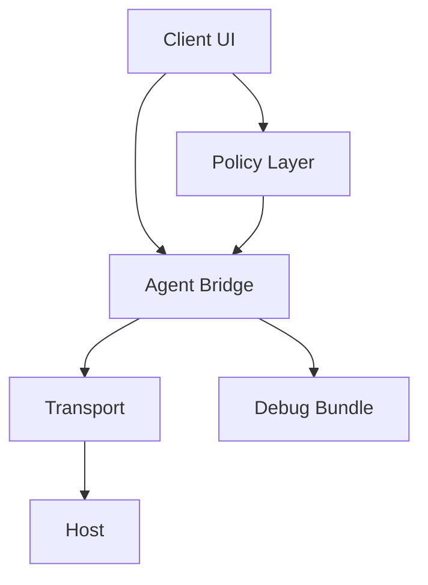

# Architecture

ClawDesk is organized around a small set of auditable boundaries.

## Components

| Component | Role | Status |
| --- | --- | --- |
| Host | Desktop shell, local state, approvals, and policy enforcement. | Implemented / evolving |
| Client UI | React/Tauri UI for workspaces, approvals, diagnostics, and release surfaces. | Implemented |
| Agent Bridge | Local bridge contract for observe, inspect, debug, execute_safe, and request_approval flows. | Experimental |
| Transport | Local-first transport and explicit pairing before any sensitive handoff. | Experimental |
| Debug Bundle | Redacted evidence bundle for bug reports and release review. | Experimental |
| Policy Layer | Deny-by-default safety rules and human approval gates. | Implemented |

## Data flow

## Design principles

- Local-first by default.
- Explicit pairing for sensitive actions.
- Human approval for critical actions.
- Redaction before sharing debug bundles or logs.
- No public-internet exposure unless the user explicitly configures a later transport.

