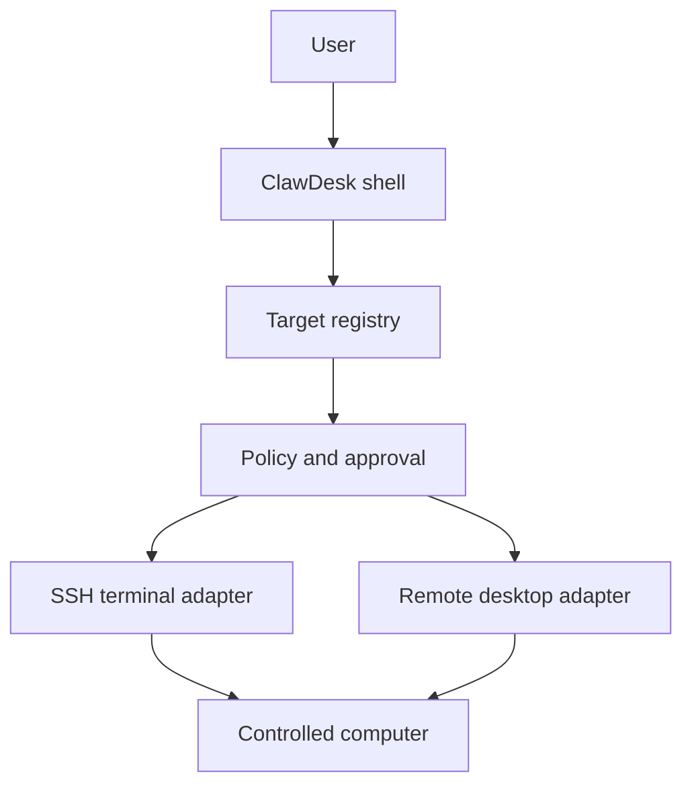

# Target Orchestration

ClawDesk is moving toward a unified dispatcher for multiple controllable computers. The goal is to let one control plane route work to local machines, SSH terminals, or remote desktop sessions without losing safety, auditability, or human approval.

This document describes the contract layer for that workflow. It is not a production claim.

## Core idea

Each remote computer is represented as a target profile. A target can expose one or more adapters:

- `local-shell`: local workstation or build host
- `ssh-terminal`: remote terminal access
- `remote-desktop`: screen/session access
- `mock`: local test adapter

The control plane chooses a target and then chooses the safest adapter for the requested action.

## Dispatch categories

- `observe`: watch a screen or shell session.
- `inspect`: query state, logs, or metadata.
- `debug`: collect diagnostics or redacted bundles.
- `execute_safe`: run an allowlisted shell command.
- `request_approval`: ask a human to approve the next step.

## Safety rules

- Pair before any remote dispatch.
- Verify SSH host keys before shell dispatch, and persist them in the gateway-managed known_hosts file.
- Issue SSH private keys as gateway-managed credential refs for secret-ref dispatch flows when ssh-agent is not used.
- Send remote-desktop control requests through the permission queue before switching into control mode.
- Require human approval for execute-safe actions.
- Only allowlisted commands may flow through `execute_safe`.
- Keep secrets out of the profile, logs, and debug bundles.
- Do not imply public-internet exposure by default.

## Current implementation surface

- Contract and dispatch helpers: [`src/lib/targets.ts`](../src/lib/targets.ts)
- Unit coverage: [`src/lib/targets.test.ts`](../src/lib/targets.test.ts)
- Target registry UI: [`src/components/TargetRegistryPanel.tsx`](../src/components/TargetRegistryPanel.tsx)
- Pairing, host-key verification, connect, disconnect, and refresh actions: [`src/lib/targets.ts`](../src/lib/targets.ts), [`src/components/TargetRegistryPanel.tsx`](../src/components/TargetRegistryPanel.tsx)
- Gateway-managed SSH credential ref issuance, allowlisted local-shell / SSH safe command execution, gateway-managed SSH terminal session contracts with redacted transcripts, and remote-desktop observe/control session contracts with permission-gated control requests through the gateway: [`sidecars/mock-gateway/server.mjs`](../sidecars/mock-gateway/server.mjs)
- Mock gateway storage for registry, connection state, and dispatch logs: [`sidecars/mock-gateway/server.mjs`](../sidecars/mock-gateway/server.mjs)
- Existing approval and policy primitives: [`src/lib/security.ts`](../src/lib/security.ts), [`src/lib/permissions.ts`](../src/lib/permissions.ts), [`src/components/PermissionModal.tsx`](../src/components/PermissionModal.tsx)
- Current gateway and desktop shell integration: [`src/lib/tauri.ts`](../src/lib/tauri.ts), [`sidecars/mock-gateway/server.mjs`](../sidecars/mock-gateway/server.mjs), [`src/App.tsx`](../src/App.tsx)

## Intended flow

1. The user selects a target from the registry.
2. The control plane resolves the safest available adapter.
3. The policy layer checks pairing, authentication, host-key verification, and command safety.
4. SSH host-key verification stores the trusted key in a gateway-managed known_hosts file before command execution.
5. Observe / inspect / debug requests can proceed when the target is ready.
6. Execute-safe requests are queued for approval before command dispatch, then can run through the local-shell or SSH safe connector.
7. The target returns screen state, terminal output, or diagnostic evidence back into the shell.

## What is not implemented yet

- A production SSH connector with interactive terminal/session management.
- A production remote desktop transport and interactive session connector.
- A production audit trail for remote sessions.
- Any claim that this is a full remote desktop clone.

## Next implementation steps

1. Add durable credential storage for SSH and remote-desktop connectors beyond the current gateway-managed secret-ref vault / ssh-agent / platform-managed defaults.
2. Add a production remote-desktop transport and interactive session connector on top of the existing gateway contract.
3. Route dispatch decisions through the existing permission queue.
4. Add audit-friendly session summaries for each target.
5. Introduce interactive SSH terminal sessions and production remote desktop transport once the safe contract is stable.
