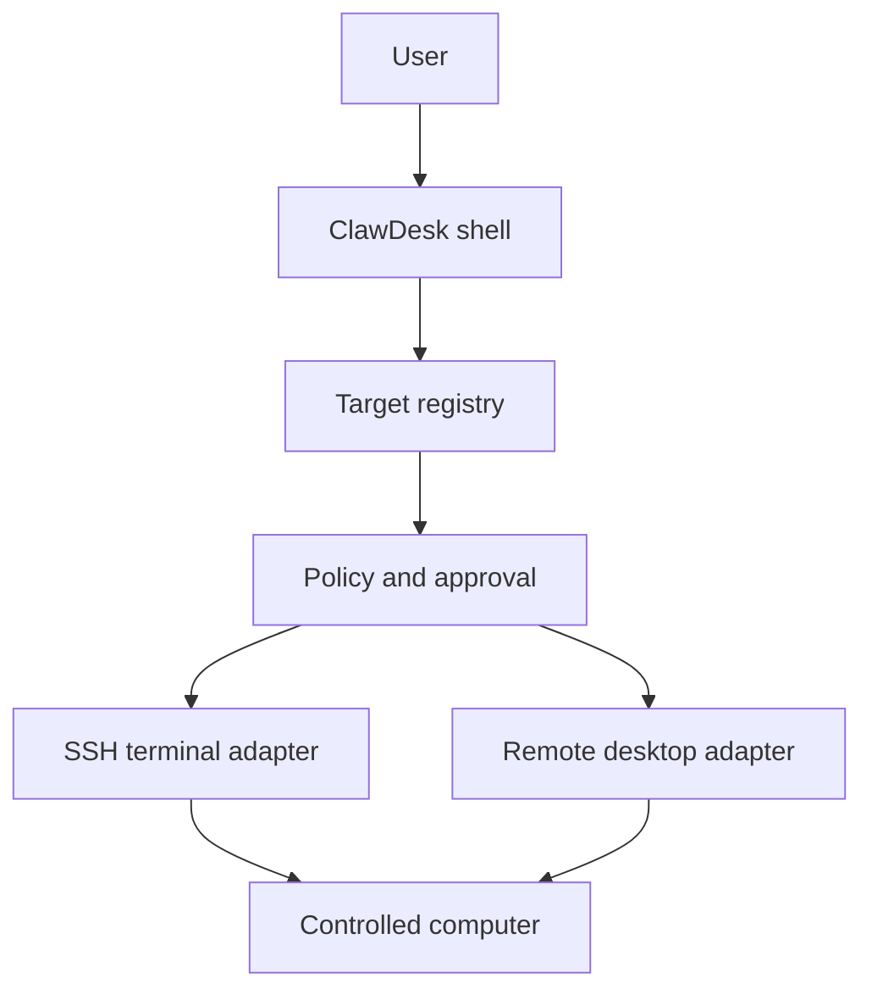

# Target Orchestration

ClawDesk is moving toward a unified dispatcher for multiple controllable computers. The goal is to let one control plane route work to local machines, SSH terminals, or remote desktop sessions without losing safety, auditability, or human approval.

This document describes the contract layer for that workflow. It is not a production claim.

## Core idea

Each remote computer is represented as a target profile. A target can expose one or more adapters:

- `local-shell`: local workstation or build host
- `ssh-terminal`: remote terminal access
- `remote-desktop`: screen/session access
- `mock`: local test adapter

The control plane chooses a target and then chooses the safest adapter for the requested action.

## Dispatch categories

- `observe`: watch a screen or shell session.
- `inspect`: query state, logs, or metadata.
- `debug`: collect diagnostics or redacted bundles.
- `execute_safe`: run an allowlisted shell command.
- `request_approval`: ask a human to approve the next step.

Saved target groups let operators keep recurring broadcast sets, such as local + SSH fleets or remote ops sets, and reuse them across dispatch sessions without rebuilding the selection each time.

## Safety rules

- Pair before any remote dispatch.
- Probe SSH / remote-desktop reachability before connect so the control plane can report a real host/port result and mark degraded targets early.
- Verify SSH host keys before shell dispatch, and persist them in the gateway-managed known_hosts file.
- Issue SSH private keys and remote-desktop login secrets as gateway-managed credential refs for secret-ref dispatch flows when ssh-agent or platform-managed secrets are not used.
- Export / import passphrase-protected credential bundles so SSH and remote-desktop secret refs can move between trusted machines without exposing plaintext secrets.
- Preview credential bundles before import so operators can confirm the target list and secret counts before rehydration.
- Preview bundle import impact so operators can see which targets will be added, updated, or left unchanged before committing the import.
- Send remote-desktop control requests through the permission queue before switching into control mode.
- Require human approval for execute-safe actions.
- Only allowlisted commands may flow through `execute_safe`.
- Keep secrets out of the profile, logs, and debug bundles.
- Do not imply public-internet exposure by default.

## Current implementation surface

- Contract and dispatch helpers: [`src/lib/targets.ts`](../src/lib/targets.ts)
- Unit coverage: [`src/lib/targets.test.ts`](../src/lib/targets.test.ts)
- Target registry UI: [`src/components/TargetRegistryPanel.tsx`](../src/components/TargetRegistryPanel.tsx)
- Pairing, host-key verification, connect, disconnect, and refresh actions: [`src/lib/targets.ts`](../src/lib/targets.ts), [`src/components/TargetRegistryPanel.tsx`](../src/components/TargetRegistryPanel.tsx)
- Connectivity probe action with host/port reachability reporting and degraded-state feedback: [`sidecars/mock-gateway/server.mjs`](../sidecars/mock-gateway/server.mjs), [`src/lib/targets.ts`](../src/lib/targets.ts), [`src/components/TargetRegistryPanel.tsx`](../src/components/TargetRegistryPanel.tsx)
- Connection readiness report with pairing, credential, host-key, and probe checks plus next-action guidance, surfaced both in the selected target details and the target list badges: [`sidecars/mock-gateway/server.mjs`](../sidecars/mock-gateway/server.mjs), [`src/lib/targets.ts`](../src/lib/targets.ts), [`src/components/TargetRegistryPanel.tsx`](../src/components/TargetRegistryPanel.tsx)
- Target list quick actions that execute the recommended next connection step directly from each target card, plus a copyable readiness report for issues and approvals: [`src/components/TargetRegistryPanel.tsx`](../src/components/TargetRegistryPanel.tsx)
- Multi-target safe execute that can broadcast the same allowlisted command to several selected SSH/local targets and collect per-target results: [`sidecars/mock-gateway/server.mjs`](../sidecars/mock-gateway/server.mjs), [`src/components/TargetRegistryPanel.tsx`](../src/components/TargetRegistryPanel.tsx)
- Saved target groups / fleet presets that can be applied to the broadcast selection and persisted through the registry save flow: [`src/lib/targets.ts`](../src/lib/targets.ts), [`src/components/TargetRegistryPanel.tsx`](../src/components/TargetRegistryPanel.tsx), [`sidecars/mock-gateway/server.mjs`](../sidecars/mock-gateway/server.mjs)
- Gateway-managed SSH credential ref issuance, allowlisted local-shell / SSH safe command execution, gateway-managed SSH terminal session contracts with redacted transcripts and audit-friendly summaries, and remote-desktop observe/control session contracts with permission-gated control requests plus a gated native client launch helper, credential-seed action, and session summaries through the gateway. Remote-desktop secret-ref credentials can be seeded into the local Windows client flow before launch: [`sidecars/mock-gateway/server.mjs`](../sidecars/mock-gateway/server.mjs)
- Passphrase-protected credential bundle export/import for target registry migration and gateway-managed credential ref rehydration: [`sidecars/mock-gateway/server.mjs`](../sidecars/mock-gateway/server.mjs), [`src/components/TargetRegistryPanel.tsx`](../src/components/TargetRegistryPanel.tsx)
- Bundle preview before import so operators can inspect target/secret summaries without exposing plaintext secrets: [`sidecars/mock-gateway/server.mjs`](../sidecars/mock-gateway/server.mjs), [`src/components/TargetRegistryPanel.tsx`](../src/components/TargetRegistryPanel.tsx)
- Mock gateway storage for registry, connection state, dispatch logs, per-target session timelines, and a toggleable target/global dispatch view in the UI; remote desktop control requests and permission results are audited into the same timeline: [`sidecars/mock-gateway/server.mjs`](../sidecars/mock-gateway/server.mjs), [`src/components/TargetRegistryPanel.tsx`](../src/components/TargetRegistryPanel.tsx)
- Shareable target audit report export that combines readiness checks, session snapshots, timeline snapshots, and redacted summaries for handoff / issue tracking: [`sidecars/mock-gateway/server.mjs`](../sidecars/mock-gateway/server.mjs), [`src/components/TargetRegistryPanel.tsx`](../src/components/TargetRegistryPanel.tsx)
- The audit report can also be copied or downloaded as a redacted Markdown handoff artifact from the target panel: [`src/components/TargetRegistryPanel.tsx`](../src/components/TargetRegistryPanel.tsx)
- SSH and remote-desktop session exports can be downloaded from the corresponding session panels as Markdown handoff artifacts with transcript / launch-history summaries: [`src/components/TargetRegistryPanel.tsx`](../src/components/TargetRegistryPanel.tsx)
- Existing approval and policy primitives: [`src/lib/security.ts`](../src/lib/security.ts), [`src/lib/permissions.ts`](../src/lib/permissions.ts), [`src/components/PermissionModal.tsx`](../src/components/PermissionModal.tsx)
- Current gateway and desktop shell integration: [`src/lib/tauri.ts`](../src/lib/tauri.ts), [`sidecars/mock-gateway/server.mjs`](../sidecars/mock-gateway/server.mjs), [`src/App.tsx`](../src/App.tsx)

## Intended flow

1. The user selects a target from the registry.
2. The control plane resolves the safest available adapter.
3. The policy layer checks pairing, authentication, host-key verification, connectivity probe results, connection readiness, and command safety.
4. SSH host-key verification stores the trusted key in a gateway-managed known_hosts file before command execution.
5. Observe / inspect / debug requests can proceed when the target is ready.
6. Execute-safe requests are queued for approval before command dispatch, then can run through the local-shell or SSH safe connector.
7. The target returns screen state, terminal output, or diagnostic evidence back into the shell.

## What is not implemented yet

- A production SSH connector with interactive terminal/session management.
- A production remote desktop transport and interactive session connector.
- A production audit trail for remote sessions.
- Any claim that this is a full remote desktop clone.

## Next implementation steps

1. Expand the remote-desktop credential-seed flow into a production transport and interactive session connector on top of the existing gateway contract.
2. Add durable credential storage for SSH and remote-desktop connectors beyond the current gateway-managed secret-ref vault / ssh-agent / platform-managed defaults where needed.
3. Route dispatch decisions through the existing permission queue.
4. Add richer audit timelines for each target.
5. Introduce interactive SSH terminal sessions and production remote desktop transport once the safe contract is stable.
